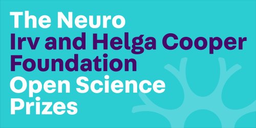

# BIDS MAINTAINERS MEETING - 10-12 / 06 / 2025

Organized by the [OpenNeuroPET project](https://openneuropet.github.io/), the workshop physically bring together the international working group of the [Brain Imaging Data Structure](www.bids-standard.org) maintainers. 

[Goals](meeting_golas.md)

_Schedule is 9 am to 5 pm - lunch at 1pm_

**Day 1** is dedicated to enhance interaction with EU related projects, in particular with EBRAINS but also specific BEP close to completion lead by EU developpers.  

**9:** Welcome (Cyril) and EBRAINS presentation (Lyuba)  
**9.45:**  WP2 5M connectome and Clinical Connectome (Chiara) -- discuss how best to submit new data types and derivatives (one huge project, lots of 'new' files)   
**10.30:** BIDS2OpenMinds (Peyman)   
**11.15:** HiPP (Florian)  
**12.00:** How to use the BIDS Schema in applications -- BIDS2OpenMinds, HiPP support   
**13.00:** Lunch and free work  
**14.30:** EBRAINS Atlases (Timo) -- state of the current BEP38  
**15:30:** open discussion on suffixes (https://meet.google.com/mgv-xkpd-oct)

    
**Day 2-3** Intended for BIDS mainainers to have space to work togther solving GitHub issues and help BEP leads.

This meeting is supported by funding from The Neuro Irv and Helga Cooper Foundation ([BIDS Open Science Prize 2023](https://www.mcgill.ca/neuro/article/rewarding-excellence-open-science)) and by The Novo Nordisk Foundation

  
  

---

## [Location](location.md)

The meeting is taking place at the [Scandic Falkoner hotel](https://www.scandichotels.com/hotels/denmark/copenhagen/scandic-falkoner).

## Local organizers

Cyril Pernet: cyril.pernet [at] nru.dk

## Attendees

Participants are members of the BIDS steering group, BIDS maintainers and individuals developping BEPs or project necessiting BIDS inputs. The full [list of participants with affiliations and projects can be found here](attendees.md).

Quick overview over the three days

| Tueday                | Wednesday             | Tursday               |
|-----------------------|-----------------------|-----------------------|
| Yaroslav Halchenko    | Yaroslav Halchenko    | Yaroslav Halchenko    |
| Cyril Pernet          | Cyril Pernet          |                       |
| Chris Markiewicz      | Chris Markiewicz      | Chris Markiewicz      |
| Anthony Galassi       | Anthony Galassi       | Anthony Galassi       |
| Christine Rogers      | Christine Rogers      | Christine Rogers      |
| Julia-Katharina Pfarr | Julia-Katharina Pfarr | Julia-Katharina Pfarr |
| Eric Earl             | Eric Earl             | Eric Earl             |
| Nell Hardcastle       | Nell Hardcastle       | Nell Hardcastle       |
| Seyed Yahya Shirazi   | Seyed Yahya Shirazi   | Seyed Yahya Shirazi   |
| Jean Baptiste Poline  | Jean Baptiste Poline  | Jean Baptiste Poline  |
| Florian Sipp          |                       |                       |
| Lyuba Zehl            | Lyuba Zehl            | Lyuba Zehl            |
| Timo Dickscheid       |                       |                       |
| Chiara Tuzzato        |                       |                       |
| Peyman Najafi         |                       |                       |
| Ben Dichter           | Ben Dichter           | Ben Dichter           |
|                       | Hugo Boniface         | Hugo Boniface         |
|                       | Martin Nørgaard       | Martin Nørgaard       | 

## Transport

- Metro/Bus/etc tickets can be purchased via the [DOT app](https://dinoffentligetransport.dk/en/find-tickets/dot-tickets-app)
- [Donkey Bike](https://www.donkey.bike/denmark) Affordable long and short term bike rental 

## Misc

- [HolaFly](https://esim.holafly.com/esim-denmark/) E-sim for Denmark w/ unlimited data

### Outputs

// to do //
