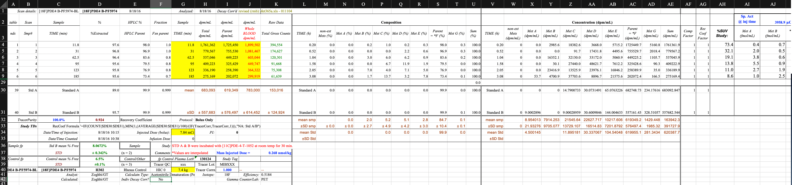

# Open Science Room Discussion Topics
This is a brief outline of some of the subjects that we at OpenNeuroPet wish to highlight and discuss during an open science room
at this years OHBM meeting, that is if we are able to secure a room.

**PET BIDS Topic List**

- BEP 009
- The addition of PET data into Open Neuro ~> coming soon datasets from the NRU and NIMH
- Some brief overview of what makes PET data unique (meta data examples, ecat, dicom, etc)


## Bids Extension Proposal 009

### Meat and Potatoes
- As of April 7th 2021 PET data is now accepted/incorporated into the BIDS standard
- Special kudos to Melanie Ganz!
- Additionally a preprint of the accompanying article has been released at `bioRxiv` [here](https://www.biorxiv.org/content/10.1101/2021.06.16.448390v1)

### Some pre-history/pre-BIDS

Previous work in the adoption of better standards and practices initially started in 2007 with the publishing of the following paper:  
- Innis, R. B.et al.Consensus nomenclature for in vivo imaging of reversibly binding radioligands. J. Cereb. Blood Flow &240Metab.27, 1533–1539 (2007)
The work got continued by the NRM community in 2016 and guidelines for reporting on and publishing PET studies came out last year:
- Knudsen, Gitte M., et al.Guidelines for the content and format of PET brain data in publications and archives: A consensus paper. J. Cereb. Blood Flow &240Metab.40.8 (2020)

## OpenNeuro PET

### On the database side

BIDSified PET data has existed on OpenNeuro for at least the past 3 years with an upload of some examples from the CIMBI dataset, additional datasets have slowly
been added. It is the current intent of OpenNeuro and researchers at the NIMH, NRU at the University of Copenhagen, and at Stanford to convert more datasets into
bids (now that it exists) and make those datasets publicly available on OpenNeuro. Emphasis on coming soon, special mention to Martin Norgaard as he has 300-400 
subjects converted.

### Concerning Tools, Methods, and other On Going Efforts

Stuff that works great for PET:
- [bids-validator](https://github.com/bids-standard/bids-validator)


At the present OpenNeuroPET is working to develop better support for PET BIDS in the form of:

- [BIDS Starter kit stuff](https://github.com/bids-standard/bids-starter-kit/)
    - [documentation on how to convert data sets to bids](https://github.com/bids-standard/bids-starter-kit/wiki/Creating-a-BIDS-compatible-PET-dataset)
    - [Buildng requered BIDS metadata text files from a PET dataset](https://github.com/CPernet/bids-starter-kit/tree/main/matlabCode)
- a matlab converter [here](https://github.com/CPernet/bids-starter-kit/tree/main/matlabCode)
- a python converter [here](https://github.com/bendhouseart/BespokeBIDSConverters/tree/nimh-dataset-1)
    - Example of metadata file for a single pet scan: [metadata](images/pet_metadata.png)
    - How we're currently dealing with that: [enter bespokeness]()

Additional work being done to better integrate PET bids PET into community:
- Better support for PET and BIDS PET in [Nibabel](https://nipy.org/nibabel/), [Pybids](https://github.com/bids-standard/pybids)

More BIDS
- Bids Extension Proposal [023](https://docs.google.com/document/d/1yzsd1J9GT-aA0DWhdlgNr5LCu6_gvbjLyfvYq2FuxlY/edit)

## Show the below if you don't want to click on links, otherwise ignore.
Direct images/code:


```python
def bespoke(self):

        future_json = {
            'Manufacturer': self.nifti_json_data['Manufacturer'],
            'ManufacturersModelName': self.nifti_json_data['ManufacturersModelName'],
            'Units': 'Bq/mL',
            'TracerName': self.nifti_json_data['Radiopharmaceutical'],  # need to grab part of this string
            'TracerRadionuclide': self.nifti_json_data['RadionuclideTotalDose']/10**6,
            'InjectedRadioactivityUnits': 'MBq',
            'InjectedMass': self.metadata_dataframe.iloc[35, 10]*self.metadata_dataframe.iloc[38, 6],  # nmol/kg * weight
            'InjectedMassUnits': 'nmol',
            'MolarActivity': self.metadata_dataframe.iloc[0, 35]*0.000037,  # uCi to GBq
            'MolarActivityUnits': 'GBq/nmol',
            'SpecificRadioactivity': 'n/a',
            'SpecificRadioactivityUnits': 'n/a',
            'ModeOfAdministration': 'bolus',
            'TimeZero': '10:15:14',
            'ScanStart': 61,
            'InjectionStart': 0,
            'FrameTimesStart':
                [int(entry) for entry in ([0] +
                list(cumsum(self.nifti_json_data['FrameDuration']))[0:len(self.nifti_json_data['FrameDuration']) - 1])],
            'FrameDuration': self.nifti_json_data['FrameDuration'],
            'AcquisitionMode': 'list mode',
            'ImageDecayCorrected': True,
            'ImageDecayCorrectionTime': -61,
            'ReconMethodName': self.dicom_header_data.ReconstructionMethod,
            'ReconMethodParameterLabels': ['iterations', 'subsets', 'lower energy threshold', 'upper energy threshold'],
            'ReconMethodParameterUnits': ['none', 'none', 'keV', 'keV'],
            'ReconMethodParameterValues': [
                3,
                21,
                float(min(re.findall('\d+\.\d+', str(self.dicom_header_data.EnergyWindowRangeSequence).lower()))),
                float(max(re.findall('\d+\.\d+', str(self.dicom_header_data.EnergyWindowRangeSequence).lower()))),
            ],
            'ReconFilterType': self.dicom_header_data.ConvolutionKernel,
            'ReconFilterSize': 0,
            'AttenuationCorrection': self.dicom_header_data.AttenuationCorrectionMethod,
            'DecayCorrectionFactor': self.nifti_json_data['DecayFactor']

        }

        future_blood_json = {

        }

        future_blood_tsv = {
            'time': self.metadata_dataframe.iloc[2:7, 6]*60, # convert minutes to seconds,
            'PlasmaRadioactivity': self.metadata_dataframe.iloc[2:7, 7]/60,
            'WholeBloodRadioactivity': self.metadata_dataframe.iloc[2:7, 9]/60,
            'MetaboliteParentFraction': self.metadata_dataframe.iloc[2:7, 8]/60
        }

        participants_tsv = {
            'sub_id': [self.subject_id],
            'weight': [self.dicom_header_data.PatientWeight],
            'sex': [self.dicom_header_data.PatientSex]
        }

        return {
            'future_json': future_json,
            'future_blood_json': future_blood_json,
            'future_blood_tsv': future_blood_tsv,
            'participants_info': participants_tsv
        }
```
