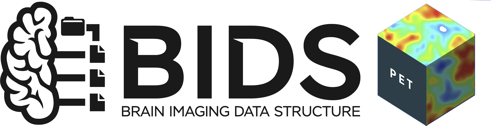

# Nordic PET-BIDS Onboarding and ezBIDS Workshop: 28-29 August 2025

The [Centre for Imaging Research (CIR)](https://imagingresearch.se/) (Karolinska Institutet) and [OpenNeuroPET](https://openneuropet.github.io/index.html)  would like to invite you to attend a free workshop on **28-29 August 2025** in **Stockholm, Sweden**.  

The workshop aims to provide hands-on training for PET researchers in the Nordics to learn about the [Brain Imaging Data Standard (BIDS)](https://bids.neuroimaging.io/index.html), especially for PET data, how to make use of this new standard for storage and/or sharing of research data, and how to take advantage of newly developed pipelines for automated processing of BIDS PET data.

----------------------------------------------------------------------------------------------------
   **DATES:** Thursday 28 - Friday 29 August, 2025

   **LOCATION:** Karolinska Institutet, Stockholm, Sweden

   **REGISTRATION:** [Complete this form ](https://forms.gle/xZjbhELEEJLtoXHw8)

----------------------------------------------------------------------------------------------------

## Information

#### What benefits does BIDS offer?

1. **PET Community Standard:** BIDS is the [official community standard](https://journals.sagepub.com/doi/10.1177/0271678X20905433) for sharing of PET data, simplifying future collaboration between and within research teams.  There are also an increasingly large number of [open PET datasets available on OpenNeuro](https://openneuro.org/search/modality/pet?query=%7B%22modality_selected%22%3A%22PET%22%7D).

2. **Simplified Data Infrastructure:** BIDS stores all PET information (including data not in image headers) in a data structure which is both human-readable and machine-readable, facilitating data handoff between researchers and within-group data organisation, as well as access to community-developed methods and tools.

3. **Streamlined Analysis:** BIDS enables automation to process datasets via dedicated pipelines or  "BIDS Apps" (containerized tools that can automatically process your data with minimal commands and without complex installation requirements).

4. **Future-Proof Research:** As new methods are developed, they're converted to BIDS apps that can be immediately applied to your BIDS-formatted data.

#### What are the goals of the workshop?

The workshop aims to provide practical, hands-on training in the following:

* What BIDS is and how it can be beneficial for research infrastructure and reproducible analysis.
* How BIDS can simplify sharing of research data using both open-access and closed-access.
* How to install and apply open-source tools, including ezBIDS and PET2BIDS, to facilitate data curation.
* How to install and use several recent BIDS Apps for PET data processing and analysis.
* Learn about options for EU researchers to share data.

In so doing, we hope to establish a community of Nordic PET researchers at various PET centres who can collaborate with one another and assist one another in their BIDS transitions.

#### Who is this workshop for?

The workshop will be hands-on in its focus, aiming to provide practical training to researchers and personnel who will be involved either in setting up infrastructure in the research group, or performing processing of PET BIDS data. That is to say, we expect up to about 5 attendees from any one research centre, but [get in touch](mailto:granville.matheson@ki.se) if you would like to send more.

#### What is provided?

Lunch and snacks will be provided on both days, as well as dinner on Thursday.

#### What tools will be taught and how are they useful?

This list may grow, but at present, we plan to provide hands-on training in the use of the following:

* **Data Curation**
  * **ezBIDS:** This is a tool for simplifying data conversion to BIDS with a graphical user interface, thereby allowing less technical team members to add additional data.
  * **[PET2BIDS](https://github.com/openneuropet/PET2BIDS):** This validated tool allows accurate conversion of both DICOM (`.dcm`) and ecat7 (`.v`) PET data to BIDS while extracting data from image headers.
  * **dcm2niix:** This tool simplifies conversion of DICOM MR data to BIDS.

* **Data Processing (BIDS Apps)**
  * **[petdeface](https://github.com/openneuropet/petdeface):** Defacing of PET data for data sharing
  * **petprep_hmc:** Head motion correction
  * **petprep_extract_tacs:** PET time activity curve extraction
  * **[petprep](https://github.com/nipreps/petprep):** Robust preprocessing of PET data
  * **[bloodstream](https://github.com/mathesong/bloodstream):** PET blood data processing
  * **[kinfitr](https://github.com/mathesong/kinfitr):** PET kinetic modelling and quantification

----------------------------------------------------------------------------------------------------

## Schedule

#### Thursday 28 August: Domain-General BIDS Introduction and ezBIDS tutorial (Wretlindsalen, Tomtebodavägen 18a, 171 65 Solna)

| Time   | Presenters         | Topic                                                           |
|--------|--------------------|-----------------------------------------------------------------|
| 09h30  | ☕                 | COFFEE, TEA & SNACKS                                            |
| 10h00  | Cyril Pernet       | [Introduction to BIDS](https://docs.google.com/presentation/d/1pIXA1I3y3MmbTSDKLYkwnTbK-tve9rHP/edit?usp=sharing&ouid=105032844288633808506&rtpof=true&sd=true)                                       |
| 11h00  | Martin Nørgaard    | [Analysis Workflows, Derivatives, and BIDS Apps](https://github.com/openneuropet/outreach/blob/main/PETBIDS-Onboarding2025/workflows_apps_derivatives_onboarding_stockholm_2025.pdf)                               |
| 12h00  | 🧆                 | LUNCH                                                           |
| 13h00  | Cyril Pernet       |  [Sharing brain imaging data in Europe](https://docs.google.com/presentation/d/1HzjojlnX5emINTNqyj_4jtgUuS6GVgJ3/edit?usp=sharing&ouid=105032844288633808506&rtpof=true&sd=true)                     |
| 14h00  | Melanie Ganz       | [Hands-on data curation (including ezBIDS)](https://github.com/openneuropet/outreach/blob/main/PETBIDS-Onboarding2025/BIDS_conversion_tutorial_Colab.ipynb)                       |
| 15h30  | ☕                 | COFFEE, TEA & SNACKS                                            |
| 16h00  | Melanie Ganz       | [Hands-on data curation (including ezBIDS - continued)](https://github.com/openneuropet/outreach/blob/main/PETBIDS-Onboarding2025/BIDS_conversion_tutorial_Colab.ipynb)            |

*Note: This day will also be attended by members of the KI CIR Core Facilities*  

#### Friday 29 August: PET-BIDS apps and PET-specific considerations (Wretlindsalen, Tomtebodavägen 18a, 171 65 Solna)

| Time   | Presenters         | Topic                                                           |
|--------|--------------------|-----------------------------------------------------------------|
| 09h00  | All                | [PET2BIDS conversion](https://github.com/openneuropet/outreach/blob/main/PETBIDS-Onboarding2025/PET2BIDS.pdf), PET-BIDS Derivatives & PET-Specific Considerations for Data Curation |
| 10h30  | ☕                 | COFFEE, TEA & SNACKS                                            |
| 11h00  | Martin Nørgaard    | PET-BIDS Tool Demonstrations and Tutorials: Image Analysis      |
| 12h30  | 🧆                 | LUNCH                                                           |
| 13h30  | Granville Matheson | PET-BIDS Tool Demonstrations and Tutorials: Quantification      |
| 15h00  | ☕                 | COFFEE, TEA & SNACKS                                            |
| 15h30  | All                | Applying/Trying Out Lessons Learned (with supervision)          |

